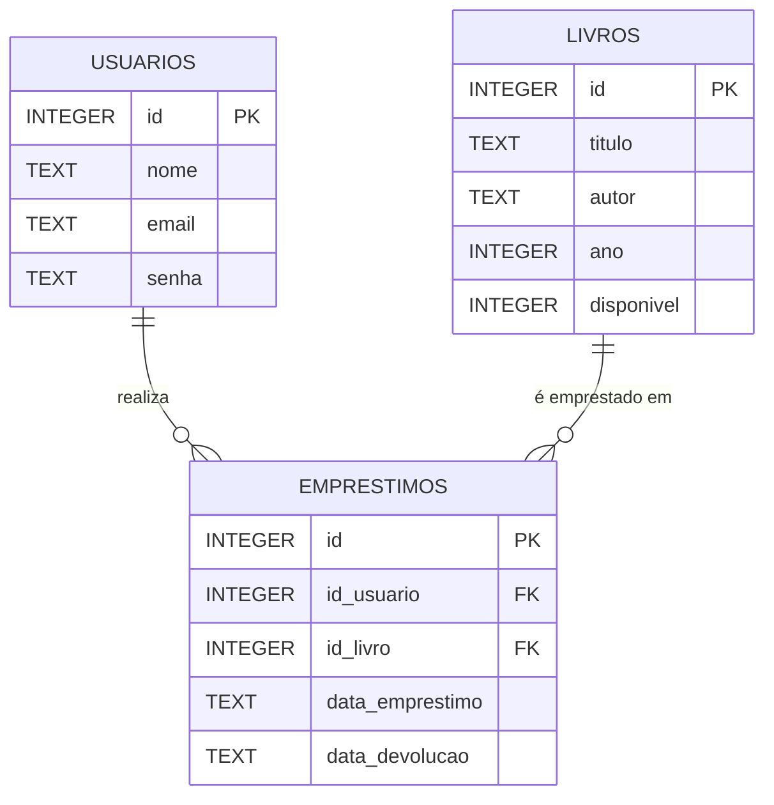

# Sistema de Controle de Empréstimos da Biblioteca Comunitária

Um sistema completo de gerenciamento de biblioteca desenvolvido em Flask com SQLite para controle de empréstimos de livros.

## 🎯 Características

- **Autenticação de Usuários**: Login seguro com criptografia SHA256
- **Gerenciamento de Usuários**: CRUD completo (criar, listar, editar, excluir)
- **Gerenciamento de Livros**: Controle de acervo com informações detalhadas
- **Controle de Empréstimos**: Sistema completo de empréstimo e devolução
- **Controle de Disponibilidade**: Status automático de livros (disponível/indisponível)
- **Interface em Português**: Sistema totalmente localizado
- **Banco de Dados SQLite**: Armazenamento local eficiente

## 📋 Funcionalidades

### Usuários
- Cadastro de novos usuários com nome, email e senha
- Listagem de todos os usuários
- Edição de dados dos usuários
- Exclusão de usuários (com validação de empréstimos ativos)

### Livros
- Cadastro de livros com título, autor, ano de publicação
- Listagem do acervo com status de disponibilidade
- Edição de informações dos livros
- Exclusão de livros (com validação de empréstimos ativos)

### Empréstimos
- Registro de novos empréstimos
- Listagem de todos os empréstimos (ativos e devolvidos)
- Processo de devolução com atualização automática de status
- Controle de datas de empréstimo e devolução

## 🗃️ Estrutura do Banco de Dados


## 🗺️ Diagrama Entidade-Relacionamento (DER) Simplificado



### Tabela: usuarios
* `id` (INTEGER PRIMARY KEY)
* `nome` (TEXT NOT NULL)
* `email` (TEXT UNIQUE NOT NULL)
* `senha` (TEXT NOT NULL)

### Tabela: livros
- `id` (INTEGER PRIMARY KEY)
- `titulo` (TEXT NOT NULL)
- `autor` (TEXT NOT NULL)
- `ano` (INTEGER)
- `disponivel` (INTEGER DEFAULT 1)

### Tabela: emprestimos
- `id` (INTEGER PRIMARY KEY)
- `id_usuario` (INTEGER NOT NULL)
- `id_livro` (INTEGER NOT NULL)
- `data_emprestimo` (TEXT NOT NULL)
- `data_devolucao` (TEXT)

## 🚀 Como Executar

1. Instale as dependências:
   ```bash
   pip install -r requirements.txt
   ```

2. Execute a aplicação:
   ```bash
   python app.py
   ```

3. Acesse no navegador: `http://127.0.0.1:5001`

## 👥 Dados de Exemplo

O sistema vem pré-configurado com dados de exemplo:

### Usuários:
- Ana Silva (ana@email.com) - senha: 1234
- João Souza (joao@email.com) - senha: abcd
- Maria Lima (maria@email.com) - senha: senha

### Livros:
- Dom Casmurro - Machado de Assis (1899)
- O Pequeno Príncipe - Antoine de Saint-Exupéry (1943)
- 1984 - George Orwell (1949)

### Empréstimos Iniciais:
- Ana Silva → Dom Casmurro (29/09/2025)
- João Souza → O Pequeno Príncipe (28/09/2025)  
- Maria Lima → 1984 (27/09/2025)

## 🗂️ Estrutura do Projeto

```
├── app.py                 # Aplicação principal Flask
├── requirements.txt       # Dependências Python
├── database.db           # Banco de dados SQLite
├── templates/            # Templates HTML
│   ├── base.html         # Template base
│   ├── login.html        # Página de login
│   ├── index.html        # Página inicial
│   ├── usuarios.html     # Gerenciamento de usuários
│   ├── novo_usuario.html # Cadastro de usuário
│   ├── editar_usuario.html # Edição de usuário
│   ├── livros.html       # Gerenciamento de livros
│   ├── novo_livro.html   # Cadastro de livro
│   ├── editar_livro.html # Edição de livro
│   ├── emprestimos.html  # Gerenciamento de empréstimos
│   └── novo_emprestimo.html # Novo empréstimo
└── README.md             # Este arquivo
```

## 💡 Como Usar

1. **Login**: Use um dos usuários de exemplo ou crie novos
2. **Menu Principal**: Acesse as três seções principais do sistema
3. **Usuários**: Gerencie o cadastro de usuários da biblioteca
4. **Livros**: Controle o acervo de livros disponíveis
5. **Empréstimos**: Registre empréstimos e devoluções

## 🔒 Segurança

- Senhas são criptografadas usando SHA256
- Sessões Flask para controle de autenticação
- Validações de integridade referencial no banco de dados
- Proteção contra exclusão de registros com dependências ativas